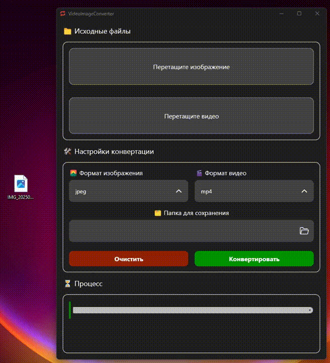
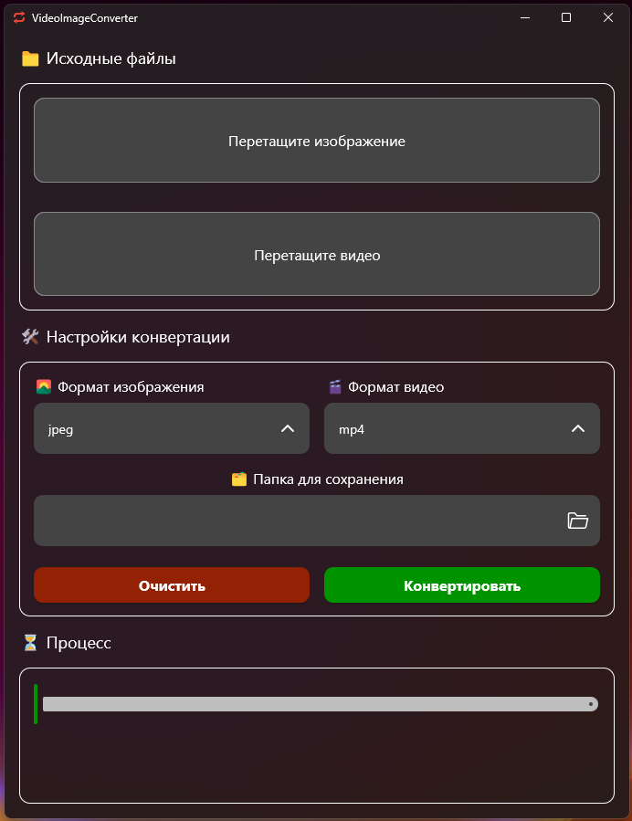

# 🎬 VideoImageConverter

Мощное десктопное приложение для конвертации изображений и видео, созданное на Kotlin с использованием Compose Multiplatform.

## ✨ Особенности

### 🖼️ Конвертация изображений
- **Поддерживаемые форматы  файлов**: PSD, BMP, TIF, TIFF, GIF, PNG, JPG, JPEG, WEBP 
- **Батчевая обработка**: Конвертируйте несколько изображений одновременно 

### 🎥 Конвертация видео
- **Поддерживаемые форматы входных файлов**: MP4, MKV, AVI, MOV, WEBM, GIF
- **Высокое качество**: Использует FFmpeg для профессиональной конвертации 

### 🎨 Удобный интерфейс
- **Drag & Drop**: Просто перетащите файлы в приложение 
- **Темная тема**: Современный дизайн с поддержкой Mica эффектов 
- **Прогресс-бар**: Отслеживайте процесс конвертации в реальном времени 
- **Предпросмотр**: Миниатюры изображений для удобства 

## 🛠️ Технические детали

### Архитектура
- **UI Framework**: Compose Multiplatform 
- **Паттерн**: MVVM с использованием ViewModel 
- **Многопоточность**: Coroutines для фоновой обработки 

### Зависимости
- **Обработка изображений**: TwelveMonkeys ImageIO для расширенной поддержки форматов 
- **Обработка видео**: JavaCV с FFmpeg 
- **Диалоги файлов**: FileKit для нативных диалогов 
- **Стилизация окон**: Window Styler для современного внешнего вида 

## 🎨 Демонстрация

## 🎨 Скриншот

